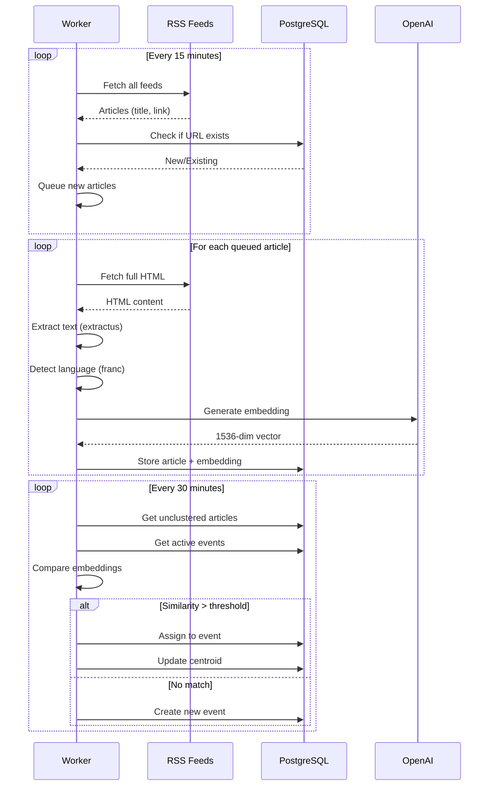

# Parallax Architecture

## System Overview

```
╔═══════════════════════════════════════════════════════════════════════════════╗
║                              PARALLAX SYSTEM                                   ║
╠═══════════════════════════════════════════════════════════════════════════════╣
║                                                                               ║
║  ┌─────────────────────────────────────────────────────────────────────────┐  ║
║  │                        📡 DATA SOURCES                                  │  ║
║  │                                                                         │  ║
║  │   ┌─────────────────┐              ┌─────────────────┐                 │  ║
║  │   │   RSS FEEDS     │              │   GDELT API     │                 │  ║
║  │   │                 │              │                 │                 │  ║
║  │   │  • NYT          │              │  Global event   │                 │  ║
║  │   │  • BBC          │              │  detection +    │                 │  ║
║  │   │  • CGTN         │              │  geolocation    │                 │  ║
║  │   │  • Yonhap       │              │                 │                 │  ║
║  │   │  • NHK          │              │                 │                 │  ║
║  │   │  • ... (35)     │              │                 │                 │  ║
║  │   └────────┬────────┘              └────────┬────────┘                 │  ║
║  │            │                                │                          │  ║
║  └────────────┼────────────────────────────────┼──────────────────────────┘  ║
║               │                                │                              ║
║               ▼                                ▼                              ║
║  ┌─────────────────────────────────────────────────────────────────────────┐  ║
║  │                     ⚙️  WORKER PROCESS                                  │  ║
║  │                     (runs separately from web server)                   │  ║
║  │                                                                         │  ║
║  │   ┌─────────────┐  ┌─────────────┐  ┌─────────────┐  ┌─────────────┐  │  ║
║  │   │ FETCH FEEDS │  │ FETCH GDELT │  │  PROCESS    │  │  CLUSTER    │  │  ║
║  │   │             │  │             │  │  ARTICLE    │  │  EVENTS     │  │  ║
║  │   │ ⏰ 15 min   │  │ ⏰ 15 min   │  │             │  │             │  │  ║
║  │   │             │  │             │  │ (on-demand) │  │ ⏰ 30 min   │  │  ║
║  │   └──────┬──────┘  └──────┬──────┘  └──────┬──────┘  └──────┬──────┘  │  ║
║  │          │                │                │                │          │  ║
║  └──────────┼────────────────┼────────────────┼────────────────┼──────────┘  ║
║             │                │                │                │              ║
║             ▼                ▼                ▼                ▼              ║
║  ┌─────────────────────────────────────────────────────────────────────────┐  ║
║  │                    🔄 PROCESSING PIPELINE                               │  ║
║  │                                                                         │  ║
║  │   ┌─────────┐    ┌─────────┐    ┌─────────┐    ┌─────────┐    ┌─────┐ │  ║
║  │   │  PARSE  │───▶│ DEDUP   │───▶│ EXTRACT │───▶│ DETECT  │───▶│EMBED│ │  ║
║  │   │  RSS    │    │  URLs   │    │  TEXT   │    │  LANG   │    │     │ │  ║
║  │   └─────────┘    └─────────┘    └─────────┘    └─────────┘    └──┬──┘ │  ║
║  │                                                                   │    │  ║
║  │   rss-parser     normalize +    @extractus     franc library   OpenAI │  ║
║  │                  check DB       article-ext    + fallback      API   │  ║
║  │                                                                   │    │  ║
║  └───────────────────────────────────────────────────────────────────┼────┘  ║
║                                                                      │       ║
║                                                                      ▼       ║
║  ┌─────────────────────────────────────────────────────────────────────────┐  ║
║  │                    🎯 EVENT CLUSTERING                                  │  ║
║  │                                                                         │  ║
║  │                        ┌──────────────────┐                            │  ║
║  │                        │  New Article     │                            │  ║
║  │                        │  (with embedding)│                            │  ║
║  │                        └────────┬─────────┘                            │  ║
║  │                                 │                                       │  ║
║  │                                 ▼                                       │  ║
║  │                   ┌─────────────────────────────┐                      │  ║
║  │                   │  Compare embedding to all   │                      │  ║
║  │                   │  active event centroids     │                      │  ║
║  │                   └─────────────┬───────────────┘                      │  ║
║  │                                 │                                       │  ║
║  │                                 ▼                                       │  ║
║  │                   ┌─────────────────────────────┐                      │  ║
║  │                   │   Cosine Similarity > ?     │                      │  ║
║  │                   │                             │                      │  ║
║  │                   │   Same language: 0.80      │                      │  ║
║  │                   │   Cross language: 0.75     │                      │  ║
║  │                   └──────────┬──────────────────┘                      │  ║
║  │                              │                                          │  ║
║  │              ┌───────────────┴───────────────┐                         │  ║
║  │              │                               │                          │  ║
║  │              ▼                               ▼                          │  ║
║  │   ┌──────────────────┐            ┌──────────────────┐                 │  ║
║  │   │  YES: Similar    │            │  NO: Not similar │                 │  ║
║  │   │                  │            │                  │                 │  ║
║  │   │  Assign article  │            │  Create NEW      │                 │  ║
║  │   │  to that event   │            │  event from      │                 │  ║
║  │   │                  │            │  this article    │                 │  ║
║  │   │  Update event's  │            │                  │                 │  ║
║  │   │  centroid        │            │                  │                 │  ║
║  │   └──────────────────┘            └──────────────────┘                 │  ║
║  │                                                                         │  ║
║  └─────────────────────────────────────────────────────────────────────────┘  ║
║                                         │                                     ║
║                                         ▼                                     ║
║  ┌─────────────────────────────────────────────────────────────────────────┐  ║
║  │                    💾 POSTGRESQL + PGVECTOR                             │  ║
║  │                                                                         │  ║
║  │   ┌─────────────────┐  ┌─────────────────┐  ┌─────────────────┐       │  ║
║  │   │    OUTLETS      │  │    ARTICLES     │  │     EVENTS      │       │  ║
║  │   │                 │  │                 │  │                 │       │  ║
║  │   │  id             │  │  id             │  │  id             │       │  ║
║  │   │  name           │  │  outlet_id ────────▶│  title          │       │  ║
║  │   │  slug           │  │  url            │  │  summary        │       │  ║
║  │   │  country        │  │  title          │  │  location       │       │  ║
║  │   │  region         │  │  content        │  │  lat/long       │       │  ║
║  │   │  language       │  │  summary        │  │  article_count  │       │  ║
║  │   │  rss_feeds[]    │  │  language       │  │                 │       │  ║
║  │   │  active         │  │  published_at   │  │  centroid_      │       │  ║
║  │   │                 │  │  event_id ──────────▶  embedding      │       │  ║
║  │   │                 │  │                 │  │  [1536 floats]  │       │  ║
║  │   │  35 rows        │  │  embedding      │  │                 │       │  ║
║  │   │                 │  │  [1536 floats]  │  │  status         │       │  ║
║  │   │                 │  │                 │  │  (active/stale) │       │  ║
║  │   └─────────────────┘  └─────────────────┘  └─────────────────┘       │  ║
║  │                                                                         │  ║
║  └─────────────────────────────────────────────────────────────────────────┘  ║
║                                         │                                     ║
║                                         ▼                                     ║
║  ┌─────────────────────────────────────────────────────────────────────────┐  ║
║  │                    🌐 NEXT.JS API ROUTES                                │  ║
║  │                                                                         │  ║
║  │   GET /api/events          GET /api/articles       GET /api/outlets    │  ║
║  │   ├─ ?status=active        ├─ ?outlet=bbc          └─ ?country=US      │  ║
║  │   ├─ ?region=east_asia     ├─ ?event_id=...                            │  ║
║  │   └─ ?since=2024-01-01     └─ ?language=en                             │  ║
║  │                                                                         │  ║
║  │   GET /api/events/[id]     GET /api/health                             │  ║
║  │   └─ Full event + all      └─ DB connectivity check                    │  ║
║  │      articles grouped                                                   │  ║
║  │      by country                                                         │  ║
║  │                                                                         │  ║
║  └─────────────────────────────────────────────────────────────────────────┘  ║
║                                         │                                     ║
║                                         ▼                                     ║
║  ┌─────────────────────────────────────────────────────────────────────────┐  ║
║  │                    🖥️ WEB FRONTEND (Phase 2)                            │  ║
║  │                                                                         │  ║
║  │   • World map with event hotspots (deck.gl)                            │  ║
║  │   • Divergence wheel showing outlet framing                            │  ║
║  │   • Outlet constellation map                                            │  ║
║  │   • Timeline view for narrative drift                                   │  ║
║  │                                                                         │  ║
║  └─────────────────────────────────────────────────────────────────────────┘  ║
║                                                                               ║
╚═══════════════════════════════════════════════════════════════════════════════╝
```

---

## Data Flow Sequence

```
TIME ──────────────────────────────────────────────────────────────────────────▶

     ┌─────────────────────────────────────────────────────────────────────────┐
     │                         EVERY 15 MINUTES                                │
     └─────────────────────────────────────────────────────────────────────────┘

     Worker                    RSS Feeds                  Database
        │                          │                          │
        │   1. Fetch all feeds     │                          │
        │─────────────────────────▶│                          │
        │                          │                          │
        │   2. Get articles        │                          │
        │◀─────────────────────────│                          │
        │   (title, link, date)    │                          │
        │                          │                          │
        │   3. For each new URL:                              │
        │   ────────────────────                              │
        │                                                     │
        │   3a. Check if exists    │                          │
        │──────────────────────────────────────────────────▶ │
        │                          │                          │
        │   3b. "No, it's new"     │                          │
        │◀──────────────────────────────────────────────────  │
        │                          │                          │
        │   3c. Queue for processing                          │
        │────────▶ [REDIS QUEUE]                              │
        │                          │                          │

     ┌─────────────────────────────────────────────────────────────────────────┐
     │                         FOR EACH QUEUED ARTICLE                         │
     └─────────────────────────────────────────────────────────────────────────┘

     Worker                   Article URL               OpenAI            DB
        │                          │                      │               │
        │   1. Fetch full HTML     │                      │               │
        │─────────────────────────▶│                      │               │
        │                          │                      │               │
        │   2. Extract text        │                      │               │
        │◀─────────────────────────│                      │               │
        │   (content, author)      │                      │               │
        │                          │                      │               │
        │   3. Detect language                            │               │
        │   (using franc)                                 │               │
        │                          │                      │               │
        │   4. Generate embedding                         │               │
        │────────────────────────────────────────────────▶│               │
        │                          │                      │               │
        │   5. Return 1536 floats                         │               │
        │◀────────────────────────────────────────────────│               │
        │                          │                      │               │
        │   6. Store article + embedding                  │               │
        │─────────────────────────────────────────────────────────────────▶
        │                          │                      │               │

     ┌─────────────────────────────────────────────────────────────────────────┐
     │                         EVERY 30 MINUTES                                │
     └─────────────────────────────────────────────────────────────────────────┘

     Worker                                              Database
        │                                                    │
        │   1. Get unclustered articles                     │
        │───────────────────────────────────────────────────▶
        │                                                    │
        │   2. Get active events                            │
        │───────────────────────────────────────────────────▶
        │                                                    │
        │   3. For each article:                            │
        │                                                    │
        │      a. Compare embedding to each event centroid  │
        │      b. cosine_similarity(article, event) > 0.75? │
        │                                                    │
        │      IF YES:                                       │
        │         - Assign article.event_id = event.id      │
        │         - Update event centroid (running avg)     │
        │                                                    │
        │      IF NO MATCH:                                  │
        │         - Create new event                        │
        │         - Set centroid = article embedding        │
        │                                                    │
        │   4. Save all changes                             │
        │───────────────────────────────────────────────────▶
        │                                                    │
```

---

## Embedding & Clustering Deep Dive

```
                            WHAT IS AN EMBEDDING?
    ═══════════════════════════════════════════════════════════

    Text:     "China conducts military exercises near Taiwan"
                                    │
                                    ▼
                            ┌───────────────┐
                            │   OpenAI API  │
                            │   text-embed- │
                            │   ding-3-small│
                            └───────────────┘
                                    │
                                    ▼
    Embedding: [0.023, -0.451, 0.122, 0.089, -0.234, ... ]  (1536 numbers)


                          WHY DO EMBEDDINGS WORK?
    ═══════════════════════════════════════════════════════════

    Similar meaning = Similar numbers = Close in 1536-dimensional space


    Article A: "PLA conducts exercises in Taiwan Strait"
                          │
                          ▼
              [0.02, -0.45, 0.12, ...]  ──────┐
                                              │
                                              │  SIMILAR
                                              │  (close together)
                                              │
              [0.03, -0.44, 0.11, ...]  ──────┘
                          ▲
                          │
    Article B: "Chinese military drills near Taiwan"


    Article C: "K-pop group BTS announces world tour"
                          │
                          ▼
              [0.78, 0.23, -0.56, ...]  ◀──── DIFFERENT
                                              (far apart)


                          HOW CLUSTERING WORKS
    ═══════════════════════════════════════════════════════════

    EVENT 1: "Taiwan Military Tensions"
    ┌─────────────────────────────────────────────────────────┐
    │  Centroid: [0.025, -0.445, 0.115, ...]                 │
    │  (average of all article embeddings in this event)     │
    │                                                         │
    │  Articles:                                              │
    │    • BBC: "China conducts military exercises"          │
    │    • NYT: "US warns of Taiwan tensions"                │
    │    • CGTN: "PLA routine training near Taiwan"          │
    └─────────────────────────────────────────────────────────┘


    NEW ARTICLE arrives: "Taiwan reports Chinese aircraft incursion"
    Embedding: [0.028, -0.442, 0.118, ...]

    Compare to Event 1 centroid:

        cosine_similarity([0.028, -0.442, 0.118, ...],
                          [0.025, -0.445, 0.115, ...])

        = 0.94  (94% similar)

        0.94 > 0.80 threshold  ✓

        → ADD to Event 1!
        → Update centroid to include new article


                      CENTROID UPDATE (Running Average)
    ═══════════════════════════════════════════════════════════

    Before: Event has 3 articles, centroid = [0.025, -0.445, 0.115]

    New article embedding = [0.028, -0.442, 0.118]

    New centroid = old_centroid + (new_embedding - old_centroid) / 4

    For first dimension:
        0.025 + (0.028 - 0.025) / 4 = 0.025 + 0.00075 = 0.02575

    After: Event has 4 articles, centroid = [0.02575, -0.4443, 0.1158]


                      WHY TWO THRESHOLDS?
    ═══════════════════════════════════════════════════════════

    Same language (EN → EN):     0.80 threshold (stricter)
    Cross language (EN → KO):    0.75 threshold (looser)

    Why? Translation affects embedding similarity.

    English: "China military exercises"     → [0.02, -0.45, ...]
    Korean:  "중국 군사 훈련"                 → [0.05, -0.42, ...]

    Same topic, but embeddings are ~75-80% similar, not 95%.
    Lower threshold catches these cross-language matches.
```

---

## File Map

```
parallax/
│
├── 📁 src/
│   ├── 📁 app/                          ◀── NEXT.JS APP ROUTER
│   │   ├── 📁 api/
│   │   │   ├── 📁 events/
│   │   │   │   ├── route.ts             GET /api/events (list)
│   │   │   │   └── 📁 [id]/
│   │   │   │       └── route.ts         GET /api/events/:id (single)
│   │   │   ├── 📁 articles/
│   │   │   │   └── route.ts             GET /api/articles
│   │   │   ├── 📁 outlets/
│   │   │   │   └── route.ts             GET /api/outlets
│   │   │   └── 📁 health/
│   │   │       └── route.ts             GET /api/health
│   │   ├── layout.tsx                   Root layout (HTML wrapper)
│   │   └── page.tsx                     Home page component
│   │
│   ├── 📁 lib/                          ◀── SHARED BUSINESS LOGIC
│   │   │
│   │   ├── 📁 db/
│   │   │   ├── schema.ts                ★ DATABASE TABLES (Drizzle ORM)
│   │   │   │                              - outlets, articles, events
│   │   │   │                              - narrative_scores (Phase 2)
│   │   │   │                              - outlet_alignments (Phase 2)
│   │   │   └── client.ts                Database connection setup
│   │   │
│   │   ├── 📁 ingestion/
│   │   │   ├── rss-parser.ts            ★ FETCH & PARSE RSS FEEDS
│   │   │   │                              - Uses rss-parser library
│   │   │   │                              - Handles various feed formats
│   │   │   │
│   │   │   ├── article-extractor.ts     ★ EXTRACT FULL ARTICLE TEXT
│   │   │   │                              - Uses @extractus/article-extractor
│   │   │   │                              - Detects language with franc
│   │   │   │                              - Falls back to RSS summary
│   │   │   │
│   │   │   ├── deduplicator.ts          ★ PREVENT DUPLICATE ARTICLES
│   │   │   │                              - Normalizes URLs (strips tracking)
│   │   │   │                              - Checks database before processing
│   │   │   │
│   │   │   └── gdelt.ts                 GDELT API integration
│   │   │                                  - Supplementary event detection
│   │   │                                  - Geographic filtering
│   │   │
│   │   ├── 📁 clustering/
│   │   │   ├── embeddings.ts            ★ OPENAI EMBEDDING GENERATION
│   │   │   │                              - Rate limiting (3 concurrent)
│   │   │   │                              - Retry with backoff
│   │   │   │                              - Cosine similarity function
│   │   │   │                              - Centroid calculation
│   │   │   │
│   │   │   └── event-clusterer.ts       ★ GROUP ARTICLES INTO EVENTS
│   │   │                                  - Language-aware thresholds
│   │   │                                  - Running centroid updates
│   │   │                                  - Stale event marking
│   │   │
│   │   ├── 📁 outlets/
│   │   │   └── registry.ts              ★ 35 OUTLET DEFINITIONS
│   │   │                                  - Name, country, region, language
│   │   │                                  - RSS feed URLs
│   │   │                                  - Helper functions
│   │   │
│   │   ├── 📁 types/
│   │   │   └── index.ts                 TypeScript type definitions
│   │   │
│   │   └── logger.ts                    Structured logging (pino)
│   │
│   └── 📁 components/                   React components (Phase 2)
│
├── 📁 worker/                           ◀── BACKGROUND JOB PROCESSOR
│   │
│   ├── index.ts                         ★ WORKER ENTRY POINT
│   │                                      - Starts all job processors
│   │                                      - Graceful shutdown handling
│   │
│   ├── queue.ts                         ★ BULLMQ QUEUE DEFINITIONS
│   │                                      - Queue creation
│   │                                      - Scheduled job setup
│   │                                      - Helper functions
│   │
│   └── 📁 jobs/
│       ├── fetch-feeds.ts               ★ RSS POLLING JOB (every 15 min)
│       │                                  - Loops through all outlets
│       │                                  - Queues new articles
│       │
│       ├── process-article.ts           ★ ARTICLE PROCESSING JOB
│       │                                  - Extract → Detect → Embed → Store
│       │
│       ├── cluster-events.ts            ★ CLUSTERING JOB (every 30 min)
│       │                                  - Groups unclustered articles
│       │
│       └── fetch-gdelt.ts               GDELT fetching job
│
├── 📁 scripts/
│   ├── seed-outlets.ts                  Populate outlets table
│   ├── test-rss.ts                      Test RSS parsing only
│   └── test-pipeline.ts                 Full integration test
│
├── 📁 docs/
│   └── architecture.md                  This file!
│
├── docker-compose.yml                   Postgres + Redis containers
├── Dockerfile.postgres                  Custom image with pgvector
├── drizzle.config.ts                    ORM configuration
├── .env.example                         Environment template
├── CLAUDE.md                            Learning guide
└── README.md                            Project overview
```

---

## Mermaid Diagrams (for GitHub/VS Code rendering)

### System Overview

```mermaid
flowchart TB
    subgraph Sources["Data Sources"]
        RSS[RSS Feeds<br/>35 outlets]
        GDELT[GDELT API]
    end

    subgraph Worker["Worker Process"]
        FetchJob[Fetch Feeds<br/>every 15 min]
        ProcessJob[Process Article]
        ClusterJob[Cluster Events<br/>every 30 min]
    end

    subgraph Pipeline["Processing"]
        Parse[Parse RSS]
        Dedup[Deduplicate]
        Extract[Extract Text]
        Lang[Detect Language]
        Embed[Generate Embedding]
    end

    subgraph Cluster["Clustering"]
        Compare[Compare to Events]
        Decision{Similar?}
        Assign[Assign to Event]
        Create[Create New Event]
    end

    subgraph DB["PostgreSQL + pgvector"]
        Outlets[(outlets)]
        Articles[(articles)]
        Events[(events)]
    end

    subgraph API["Next.js API"]
        E_API[/api/events]
        A_API[/api/articles]
        O_API[/api/outlets]
    end

    RSS --> FetchJob
    GDELT --> FetchJob
    FetchJob --> Parse --> Dedup --> ProcessJob
    ProcessJob --> Extract --> Lang --> Embed
    Embed --> Articles

    ClusterJob --> Compare
    Articles --> Compare
    Events --> Compare
    Compare --> Decision
    Decision -->|Yes| Assign --> Events
    Decision -->|No| Create --> Events

    Outlets --> O_API
    Articles --> A_API
    Events --> E_API
```

### Data Flow Sequence


